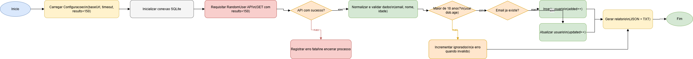

# PayTrack — Sincronização de Dados de Usuários/RH

Solução de integração de dados desenvolvida como desafio técnico para a vaga de Analista de Integrações.

O projeto consome a RandomUser API, aplica regras de negócio, persiste os dados em banco SQLite via sql.js e gera relatórios detalhados de cada execução.


---

## Visão Geral



Fluxo atual da aplicação:

1. Inicializa a conexão com o banco.
2. Consulta a RandomUser API com limite fixo de 150 usuários.
3. Valida os dados recebidos.
4. Filtra usuários menores de 18 anos.
5. Insere ou atualiza registros com base no e-mail.
6. Gera relatórios nos formatos TXT e JSON.

---

## Requisitos

| Ferramenta | Versão mínima |
|---|---|
| Node.js | 18.x |
| npm | 8.x |

---

## Instalação

```bash
npm install
```

O projeto já possui um arquivo `.env` na raiz com os valores padrão de desenvolvimento.

---

## Execução

```bash
npm start
```

O comando executa:

```bash
node src/main.js
```

As variáveis do arquivo `.env` são carregadas automaticamente pelo `dotenv`.

Ao final, a aplicação grava:

- o banco em `data/paytrack.db`
- um relatório `.txt` em `reports/`
- um relatório `.json` em `reports/`

---

## Scripts Disponíveis

```bash
npm start
npm run dev
npm test
npm test -- --verbose
npm test -- --coverage
npm test -- --watch
```

Descrição dos scripts:

| Script | Finalidade |
|---|---|
| `npm start` | Executa a sincronização uma vez |
| `npm run dev` | Executa com nodemon para desenvolvimento |
| `npm test` | Executa a suíte de testes com cobertura |

---

## Estrutura do Projeto

```text
PayTrack/
├── data/                               # Banco gerado em runtime
├── .env                                # Variáveis de ambiente da aplicação
├── reports/                            # Relatórios gerados em runtime
├── src/
│   ├── main.js                         # Entry point / composition root
│   ├── application/
│   │   └── SyncUsersUseCase.js         # Orquestra o fluxo principal
│   ├── config/
│   │   ├── index.js                    # Configurações e variáveis de ambiente
│   │   └── logger.js                   # Logger com pino
│   ├── domain/
│   │   └── Users.js                    # Entidade e regras de negócio
│   └── infrastructure/
│       ├── api/
│       │   └── RandomUsersClient.js    # Cliente HTTP da RandomUser API
│       ├── database/
│       │   ├── connection.js           # Conexão singleton com sql.js
│       │   └── UserRepository.js       # Persistência de usuários
│       └── report/
│           └── ReportGenerator.js      # Geração de relatórios TXT e JSON
├── tests/
│   ├── integration/
│   │   └── UserRepository.test.js
│   └── unit/
│       ├── application/
│       │   └── SyncUsersUseCase.test.js
│       ├── domain/
│       │   └── User.test.js
│       └── infrastructure/
│           └── RandomUsersClient.test.js
├── Fluxo.drawio
├── Fluxo.png
├── package.json
└── README.md
```

---

## Como Funciona

### 1. Coleta de dados

O cliente [RandomUsersClient.js](src/infrastructure/api/RandomUsersClient.js) consulta a API em `https://randomuser.me/api` com o parâmetro `results` fixado em `150`.

Comportamentos implementados:

- timeout configurável
- validação da estrutura da resposta
- tratamento de erro de rede, timeout e status HTTP inválido

### 2. Regras de negócio

O caso de uso [SyncUsersUseCase.js](src/application/SyncUsersUseCase.js) percorre os registros retornados e aplica:

- validação de dados mínimos
- normalização de e-mail para minúsculas
- filtro de usuários menores de 18 anos
- decisão entre inserção e atualização por e-mail

### 3. Persistência

O repositório [UserRepository.js](src/infrastructure/database/UserRepository.js) usa `sql.js` para operar sobre uma base SQLite persistida em arquivo.

Regras aplicadas no banco:

- tabela `users` criada automaticamente
- coluna `email` com restrição `UNIQUE`
- índice em `email`
- `insert` para novos usuários
- `update` para usuários já existentes

### 4. Relatórios

O gerador [ReportGenerator.js](src/infrastructure/report/ReportGenerator.js) cria dois arquivos por execução:

- `relatorio-<timestamp>.txt`
- `relatorio-<timestamp>.json`

O relatório TXT inclui resumo da execução, duração total e, quando houver, detalhes dos erros encontrados.

---

## Configuração

As configurações ficam centralizadas em [index.js](src/config/index.js).

O arquivo `.env` na raiz já contém todas as variáveis suportadas no projeto e é suficiente para rodar em desenvolvimento sem configuração adicional.

Variáveis suportadas:

| Variável | Padrão | Uso |
|---|---|---|
| `RANDOMUSER_API_URL` | `https://randomuser.me/api` | URL base da API |
| `RANDOMUSER_TIMEOUT` | `15000` | Timeout da requisição em ms |
| `DATABASE_PATH` | `data/paytrack.db` | Caminho do banco |
| `REPORTS_OUTPUT_DIR` | `reports` | Diretório de saída dos relatórios |
| `LOG_LEVEL` | `info` | Nível do logger |
| `NODE_ENV` | `development` | Ambiente de execução |

---

## Regras de Negócio

| Regra | Implementação atual |
|---|---|
| Buscar 150 usuários da API | `config.api.results` fixo em `150` |
| Aceitar apenas maiores de 18 anos | `Users.isAdult()` |
| Validar e-mail e dados mínimos | `Users.isValid()` |
| Usar e-mail como chave única | `UNIQUE` em `users.email` |
| Atualizar registro existente | `findByEmail()` seguido de `update()` |
| Inserir registro novo | `insert()` |

---

## Testes

Resultado validado no estado atual do projeto:

- 4 suítes
- 44 testes
- 100% de statements
- 100% de lines
- 100% de functions
- 74.6% de branches

Arquivos cobertos pela suíte:

- [User.test.js](tests/unit/domain/User.test.js)
- [SyncUsersUseCase.test.js](tests/unit/application/SyncUsersUseCase.test.js)
- [RandomUsersClient.test.js](tests/unit/infrastructure/RandomUsersClient.test.js)
- [UserRepository.test.js](tests/integration/UserRepository.test.js)

Executar:

```bash
npm test
```

---

## Exemplo de Saída

Saída esperada no log durante a execução:

```text
======================================================
   PayTrack — Sincronização de Usuários/RH
======================================================

[0/3] Inicializando banco de dados SQLite...
[1/3] Consultando RandomUser API (150 registros)...
[2/3] Sincronização concluída:
      ✔  Adicionados : 150
      ↻  Atualizados : 0
      ✗  Ignorados   : 0
      ⚠  Erros       : 0

[3/3] Gerando relatório...
```

Exemplo de JSON gerado:

```json
{
  "total": 150,
  "added": 150,
  "updated": 0,
  "ignored": 0,
  "errors": [],
  "startedAt": "2026-03-10T01:13:30.261Z",
  "finishedAt": "2026-03-10T01:13:31.821Z"
}
```

---

## Troubleshooting

### Timeout na API

Se a API estiver lenta, aumente o timeout em variável de ambiente ou em [index.js](src/config/index.js).

Exemplo no PowerShell:

```powershell
$env:RANDOMUSER_TIMEOUT = "30000"
npm start
```

### Muitos registros ignorados

Verifique o relatório TXT em `reports/` para identificar:

- e-mail inválido
- nome ausente
- idade ausente ou igual a zero
- usuário menor de 18 anos

### Limpar arquivos gerados no Windows PowerShell

```powershell
Remove-Item .\data\paytrack.db -ErrorAction SilentlyContinue
Remove-Item .\reports\* -Recurse -Force -ErrorAction SilentlyContinue
```

---

## Decisões Técnicas

- separação em camadas de domínio, aplicação e infraestrutura
- injeção de dependências no caso de uso principal
- prepared statements no repositório para reduzir risco de SQL injection
- logging estruturado com pino
- persistência local usando SQLite via sql.js

---

## Status Atual

Projeto funcional e executável no estado atual do repositório.

Última validação deste README: 11 de março de 2026.
